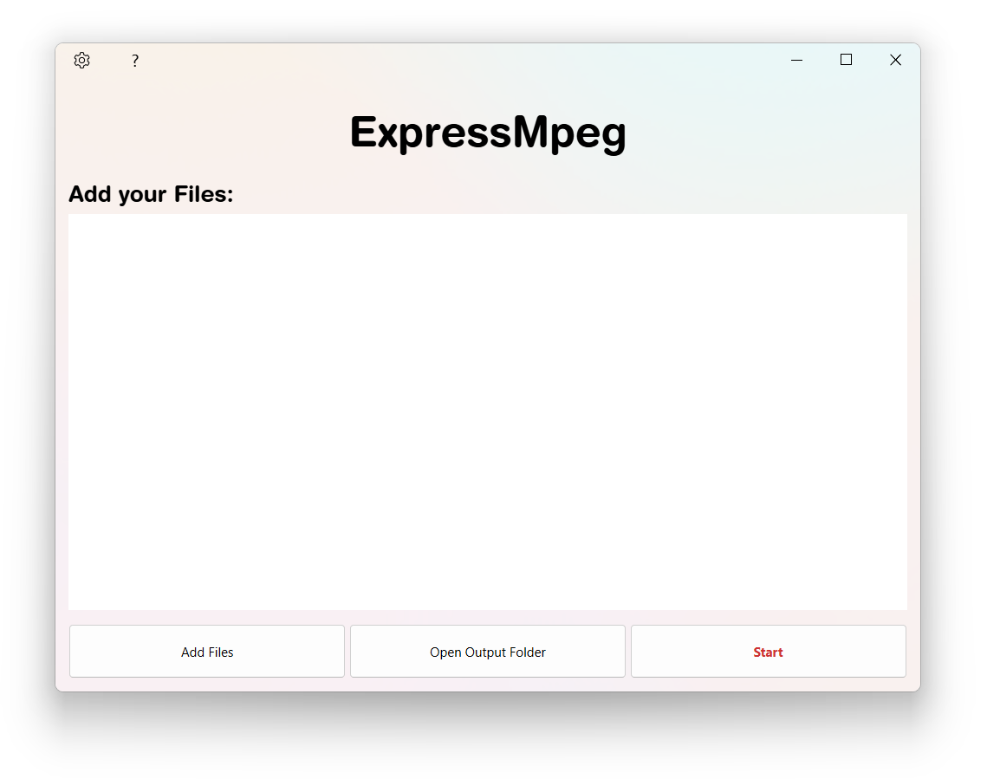

# Help

### Welcome to Expressmpeg Help.

Here are the topics you might want to know about:

- [Main Window](#main-window)
    - Adding files
    - Playing a song from ExpressMpeg
    - Delete a song
- [Start Dialog](#start-dialog)
- [While Converting](#while-converting)
  - Pause and resume
  - All files are converted
- [Settings](#Settings)
  - Output Folder
  - Output frame rate
  - Number of files being processed at the same time
  - Open Log Folder

## Main window
This is the best window of ExpressMpeg! You can either drag and drop your files or press `Add Files` to add music!

#### Adding files
Press the `Add Files` button and an *explorer window* will appear. Select the files you wish to convert and press `Ok`.

A number of files will appear in the list box.

#### Playing a song from ExpressMpeg
Press the `▶` button on the item and the file will be played using the default player.
_______________________________

________________________________

#### Deleting a song
Select a song and press the `🗑` Wallpaper button to delete the song.
You can also press the `Del` or `BackSpace` key to delete the song.
_________________________________

_________________________________

## Start dialogue
When you press `Start` you will see the start dialogue.
You can choose
- The output format.
- To send your file to the default output folder. *(see [Settings](#settings-dialogue) to learn how to change the default output folder)*.
- Replace with the old file.

Select a configuration and press `Ok`.

## While converting

#### ⏸ Pause and resume
You can `Pause` the conversion process. This will cause the file queue to pause.
If you want to resume the conversion process, press the Resume button.

#### ✓ All files will be converted

A message will be displayed when the conversion process is complete.

## Settings

#### Output Folder

You can set the output folder by clicking the `📂` button or writing the full path in the line edit.

#### Output Framerate

You can set the output framerate:

- Highest quality
- Custom quality (11025, 22050, 44100, 48000, 96000, 192000) fps

*NOTE: The framerate will only be applied if the file supports it.*

#### Number of files processed simultaneously

- If your PC has a Core i7 CPU with at least 16 GB of RAM, you can set this option to 3.
- If your PC has a Core i5 CPU with at least 8 GB of RAM, you can set this option to 2.
- If your PC has a Core i3 CPU with at least 4 GB of RAM, you can set the option to 1.

*NOTE: If the option is set too high, the application will simply quit without crashing the system.*

