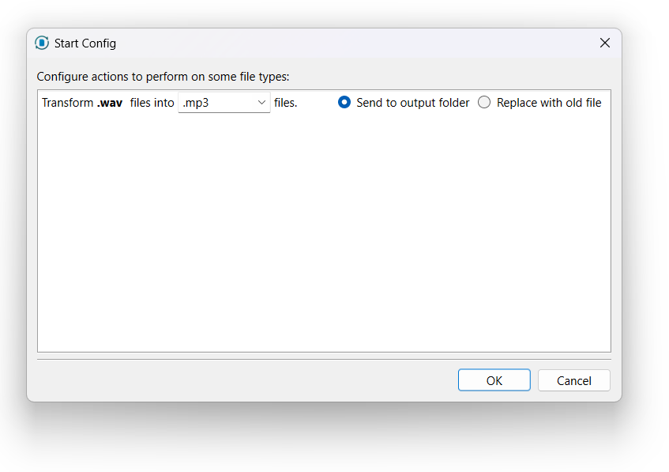
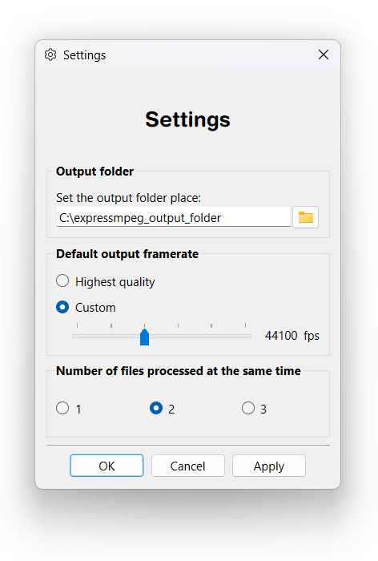

# Help

### Welcome to Expressmpeg's Help.

Here are the topics you might want to know about:

- [Main Window](#main-window)
    - Add Files
    - Play a song from ExpressMpeg
    - Delete a song
- [Start Dialog](#start-dialog)
- [While Converting](#while-converting)
  - Pause and Resume
  - All Files are Converted
- [Settings](#settings)
  - Output Folder
  - Output Framerate
  - Number of Files Processed at the Same Time
  - Open Log Folder

## Main Window
This window is the best window of ExpressMpeg! You can either drag and drop your files or press `Add Files` to add musics!!

#### Add files
Press the `Add Files` button and an *explorer window* will appear. Choose your files you want to convert and then press `Ok`.

A bunch of files will appear in the list box.

#### Play a song from ExpressMpeg
Press the `▶` button on the item and the file will be played with de default player.
_______________________________

________________________________

#### Delete a song
Select a song and press the `🗑` wallpaper button to delete the song.
You can also press `Del` or `BackSpace` key do delete the song.
_________________________________

_________________________________

## Start Dialog
When you press `Start`, you will launch the start dialog.
You can choose:
- The output format.
- To send your file to the default output folder. *(see [Settings](#settings-dialog) to learn how to change default output folder)*
- To replace with old file.

Choose a configuration and then press `Ok`.

## While Converting

#### ⏸ Pause and Resume
You can `Pause` the converting process. This will cause to pause the files queue.
If you want to restore the converting process, press the `Resume` button.

#### ✓ All Files are Converted

A message will rise when the all the conversion process is done

## Settings

#### Output Folder

You can set the output folder, clicking the `📂` button, or writing the full path in the line edit.

#### Output Framerate

You can set the output framerate to the:

- Highest quality
- Custom quality (11025, 22050, 44100, 48000, 96000, 192000) fps

*NOTE: The framerate is applied only if the file supports this framerate*

#### Number of Files Processed at the Same Time

- If your pc has a `Core i7` cpu with at least 16 GB RAM, you can set the option to 3.
- If your pc has a `Core i5` cpu with at least 8 GB RAM, you can set the option to 2.
- If your pc has a `Core i3` cpu with at least 4 GB RAM, you can set the option to 1.

*NOTE: If the option is too high, the application will simply crash without crashing the whole system.*

