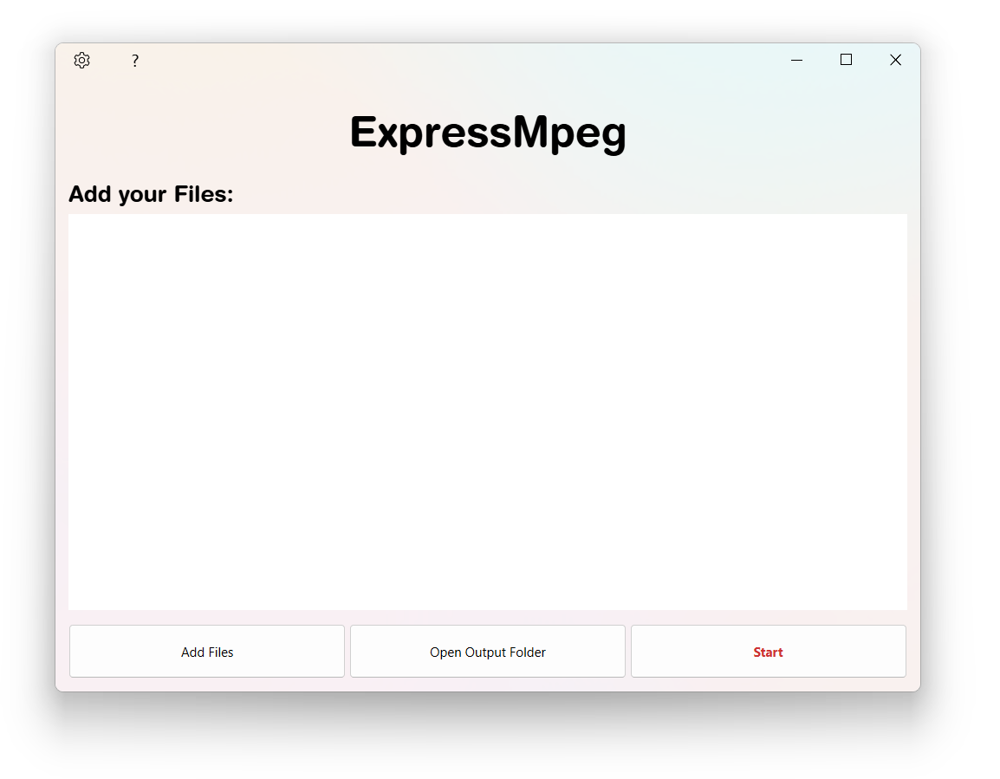

  

# ExpressMpeg

#### What is ExpressMpeg
ExpressMpeg is a windows fancy free app to convert music files easily. 
It is fully free and doesn't require account stuff and works offline.

## Install

#### 💾 Installing ExpressMpeg is very simple. 
- Click on one of these files downwards. (The last version is the best one!!!)
- Go to your download directory.
- Click the file beginning with `expressmpeg`.
- Normally, the computer asks you if you allow this program to change your computer. (It's just installing)
- If you have allowed the program to copy its files into `C:\Program Files (x86)\ExpressMpeg`, press `Agree` in the window.
- Press `Install` button.
- Wait while the installer copies all its files.
- Press `Finished` button.

Tadam! The beautiful window of expressmpeg appears. Please refer to [#Quick Start](https://github.com/ExpressMpeg/ExpressMpeg/blob/main/README.md#quick-start) to begin converting.

### Windows Software
|Platform  |  Files                                          |
|--------  | ------                                         |
|  |  [Windows x86_64 installer (v1.1)](https://www.vizysound.com/ExpressMpeg/installers/expressmpeg_x86_64_v_(1.1)_BETA.exe)  |

## Quick Start
To convert an audio, please follow these steps:
- Add your files clicking `Add Files` button or drag your files on the window.
- Press `Start` button.
- In the dialog, select what you want to do (for example, convert `.wav` files into `.mp3` and send it to the `Output Folder`).
- Press `ok` button.

Your files will be in the output folder.
Press `Open Ouput Folder` to see your files.

*NOTE: You can pause at any moment converting clicking `Pause` button.*

## Updates

Updates will appeare here.
For now, no updates are available.

## Bugs
Unfortunatly, ExpressMpeg is not fully bugfixed. If a bug appears, folow these instructions:

- Press `?` button on the top left corner of the window.
- Press `Open Log Folder` button. 
*An explorer window will appear*
- You should see a file called `DEBUG.log`.
- Send this file to [expressmpeg@gmail.com](mailto:expressmpeg.com) and we'll try to fix the bug.

We appreciate so much these kind of help 💜.
## License
ExpressMpeg is licensed under [MIT](./LICENSE).

*Copyright © 2023 by Jean Moïse Talec.*
